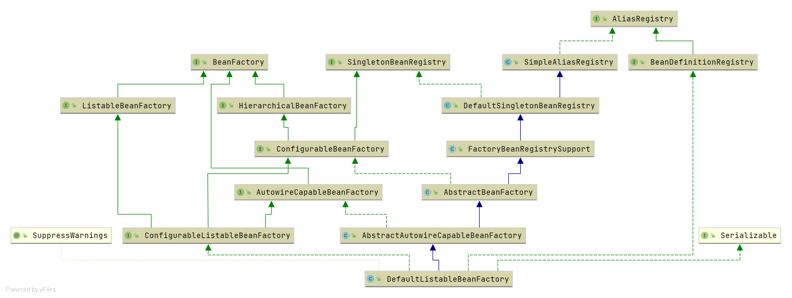

# Spring DefaultListableBeanFactory

- 类全路径: `org.springframework.beans.factory.support.DefaultListableBeanFactory`
- 类图
  
  
- 在类图中我们可以在阅读 `DefaultListableBeanFactory` 之前需要先去了解类图上的一些类和接口

<details>
<summary>继承关系分析</summary>

- [AbstractAutowireCapableBeanFactory](/doc/book/bean/factory/Spring-AbstractAutowireCapableBeanFactory.md)
- [AbstractBeanFactory](/doc/book/bean/factory/Spring-AbstractBeanFactory.md)
- [FactoryBeanRegistrySupport](/doc/book/bean/registry/Spring-FactoryBeanRegistrySupport.md)
- [DefaultSingletonBeanRegistry](/doc/book/bean/registry/Spring-DefaultSingletonBeanRegistry.md)
- [SimpleAliasRegistry](/doc/context/Spring-SimpleAliasRegistry.md)

- ConfigurableListableBeanFactory
- AutowireCapableBeanFactory
- ConfigurableBeanFactory
- HierarchicalBeanFactory
- ListableBeanFactory
- BeanFactory
- SingletonBeanRegistry

</details>


**在阅读本文之前请各位一定阅读继承关系分析中的类分析, 本文不会对父类或者引用方法进行分析请善用<KBD>CTRL + F</KBD>**


## 成员变量


<details>
<summary>DefaultListableBeanFactory 成员变量如下</summary>

```java
public class DefaultListableBeanFactory extends AbstractAutowireCapableBeanFactory
      implements ConfigurableListableBeanFactory, BeanDefinitionRegistry, Serializable {

   /**
    * Map from serialized id to factory instance.
    *
    * key: 序列化id
    *
    * value: DefaultListableBeanFactory
    *
    * */
   private static final Map<String, Reference<DefaultListableBeanFactory>> serializableFactories =
         new ConcurrentHashMap<>(8);

   @Nullable
   private static Class<?> javaxInjectProviderClass;

   /**
    * Map from dependency type to corresponding autowired value.
    *
    * key: 依赖类型
    * value: 依赖类型对应的值
    *
    * */
   private final Map<Class<?>, Object> resolvableDependencies = new ConcurrentHashMap<>(16);

   /**
    * Map of bean definition objects, keyed by bean name.
    *
    * bean定义容器
    * key: beanName
    * value: BeanDefinition
    *
    *  */
   private final Map<String, BeanDefinition> beanDefinitionMap = new ConcurrentHashMap<>(256);

   /**
    *  Map of singleton and non-singleton bean names, keyed by dependency type.
    * 类型和别名的映射关系
    * key: 类型
    * value: 别名
    * */
   private final Map<Class<?>, String[]> allBeanNamesByType = new ConcurrentHashMap<>(64);

   /**
    *  Map of singleton-only bean names, keyed by dependency type.
    *  单例bean的别名映射
    *
    *  key: 类型
    *  value: 别名
    *
    * */
   private final Map<Class<?>, String[]> singletonBeanNamesByType = new ConcurrentHashMap<>(64);

   /**
    *  Optional id for this factory, for serialization purposes.
    * 序列化 id (BeanFactory 的id)
    * */
   @Nullable
   private String serializationId;

   /**
    *  Whether to allow re-registration of a different definition with the same name.
    * 是否允许名字不同但是bean定义相同
    * */
   private boolean allowBeanDefinitionOverriding = true;

   /**
    *  Whether to allow eager class loading even for lazy-init beans.
    * 延迟加载的Bean是否立即加载
    * */
   private boolean allowEagerClassLoading = true;

   /** Optional OrderComparator for dependency Lists and arrays. */
   @Nullable
   private Comparator<Object> dependencyComparator;

   /**
    *  Resolver to use for checking if a bean definition is an autowire candidate.
    *  用来进行 自动注入(自动装配)的解析类
    * */
   private AutowireCandidateResolver autowireCandidateResolver = new SimpleAutowireCandidateResolver();

   /**
    * List of bean definition names, in registration order.
    * bean definition 名称列表
    * */
   private volatile List<String> beanDefinitionNames = new ArrayList<>(256);

   /**
    * List of names of manually registered singletons, in registration order.
    * 按照注册顺序放入 单例的beanName
    *
    * */
   private volatile Set<String> manualSingletonNames = new LinkedHashSet<>(16);

   /**
    *
    * Cached array of bean definition names in case of frozen configuration.
    * bean definition 的名称列表
    * */
   @Nullable
   private volatile String[] frozenBeanDefinitionNames;

   /**
    *  Whether bean definition metadata may be cached for all beans.
    * 是否需要给bean元数据进行缓存
    * */
   private volatile boolean configurationFrozen = false;
}
```


</details>


在类图之外我们还需要了解成员变量中的一些接口, 下面列出重点接口

1. `BeanDefinition`: [分析文章](/doc/book/bean/BeanDefinition/Spring-BeanDefinition.md)
2. `AutowireCandidateResolver`: [分析文章](/doc/book/bean/factory/support/AutowireCandidateResolver/Spring-AutowireCandidateResolver.md)


## 方法分析

### copyConfigurationFrom

- 方法签名: `org.springframework.beans.factory.support.DefaultListableBeanFactory#copyConfigurationFrom`

- 方法作用: 配置信息拷贝


拷贝行为即对象赋值, 在这里直接贴出代码, 不做分析. 

<details>
<summary>copyConfigurationFrom 详细代码</summary>

```java
@Override
public void copyConfigurationFrom(ConfigurableBeanFactory otherFactory) {
   super.copyConfigurationFrom(otherFactory);
   if (otherFactory instanceof DefaultListableBeanFactory) {
      DefaultListableBeanFactory otherListableFactory = (DefaultListableBeanFactory) otherFactory;
      this.allowBeanDefinitionOverriding = otherListableFactory.allowBeanDefinitionOverriding;
      this.allowEagerClassLoading = otherListableFactory.allowEagerClassLoading;
      this.dependencyComparator = otherListableFactory.dependencyComparator;
      // A clone of the AutowireCandidateResolver since it is potentially BeanFactoryAware...
      setAutowireCandidateResolver(
            BeanUtils.instantiateClass(otherListableFactory.getAutowireCandidateResolver().getClass()));
      // Make resolvable dependencies (e.g. ResourceLoader) available here as well...
      this.resolvableDependencies.putAll(otherListableFactory.resolvableDependencies);
   }
}
```


</details>


下面将介绍一个十分重要的方法`getBean`


### getBean

- 方法签名: `org.springframework.beans.factory.support.DefaultListableBeanFactory#getBean(java.lang.Class<T>, java.lang.Object...)`

- 方法作用: 获取bean实例


首先了解方法参数

1. `Class<T> requiredType`: bean 类型
2. `@Nullable Object... args` : bean 初始化时需要的参数


<details>
<summary>getBean 详细代码</summary>

```java
@SuppressWarnings("unchecked")
@Override
public <T> T getBean(Class<T> requiredType, @Nullable Object... args) throws BeansException {
   Assert.notNull(requiredType, "Required type must not be null");
   // 解析bean
   Object resolved = resolveBean(ResolvableType.forRawClass(requiredType), args, false);
   if (resolved == null) {
      throw new NoSuchBeanDefinitionException(requiredType);
   }
   return (T) resolved;
}
```

</details>


重点关注

`Object resolved = resolveBean(ResolvableType.forRawClass(requiredType), args, false);` 这段代码，将这段代码一分为二

1. `resolveBean`函数
2. `ResolvableType.forRawClass(requiredType)`参数


#### forRawClass

- 方法签名: `org.springframework.core.ResolvableType#forRawClass`


`forRawClass`的方法很简单, 就是一个构造函数的编写. 以及重写了部分方法


<details>
<summary>forRawClass 代码</summary>

```java
public static ResolvableType forRawClass(@Nullable Class<?> clazz) {
   return new ResolvableType(clazz) {
      @Override
      public ResolvableType[] getGenerics() {
         return EMPTY_TYPES_ARRAY;
      }
      @Override
      public boolean isAssignableFrom(Class<?> other) {
         return (clazz == null || ClassUtils.isAssignable(clazz, other));
      }
      @Override
      public boolean isAssignableFrom(ResolvableType other) {
         Class<?> otherClass = other.resolve();
         return (otherClass != null && (clazz == null || ClassUtils.isAssignable(clazz, otherClass)));
      }
   };
}
```


</details>


### resolveBean

- 方法签名: `org.springframework.beans.factory.support.DefaultListableBeanFactory#resolveBean`